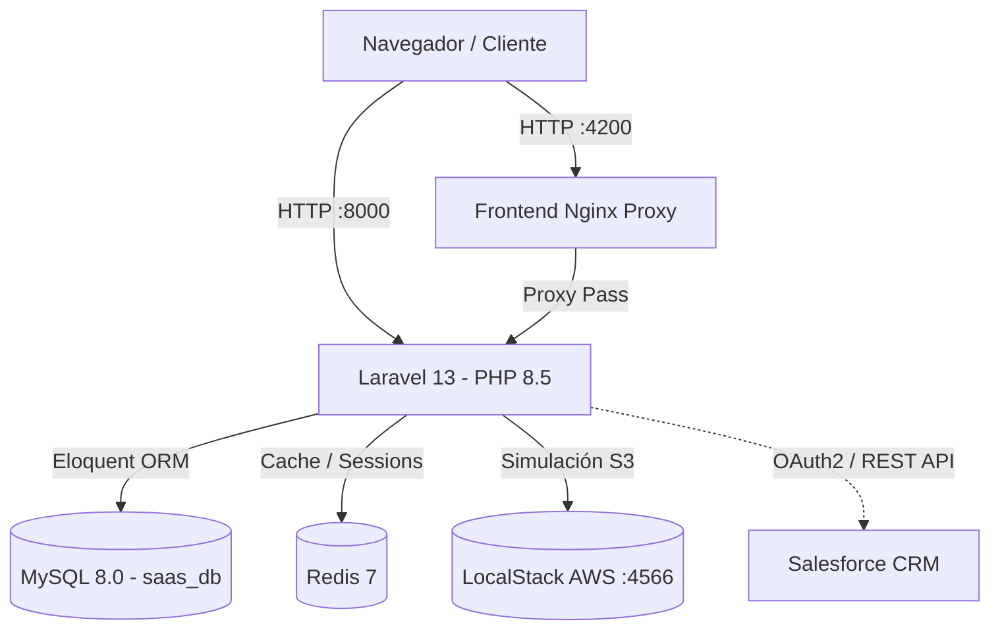

# PS Tenant — Sistema SaaS Multitenant de Gestión de Inventario y Ventas

**Proyecto Final Capstone**  
**Integrantes del Equipo:**
- José Carlos Muñoz Alberti
- Leonardo David Vargas Monasterio

---

## 1. Visión General del Proyecto
PS Tenant es una plataforma SaaS (Software as a Service) multitenant orientada a la gestión centralizada de inventarios, productos y ventas para múltiples empresas. El sistema ofrece aislamiento completo de datos a nivel de base de datos, una interfaz web reactiva, flujos de cobro QR transaccionales y preparación para sincronización con CRM Salesforce.

---

## 2. Arquitectura del Sistema



### Tecnologías Principales:
- **Backend:** Laravel 13, PHP 8.5, Laravel Sanctum (Bearer Tokens).
- **Frontend:** Laravel Blade, Bootstrap 5.3 CDN, JavaScript Moderno (Vanila ES6+).
- **Base de Datos:** MySQL 8.0 con Global Scopes Eloquent para Multi-Tenancy.
- **Cache & Colas:** Redis 7.
- **Contenedores:** Docker Compose con 5 servicios integrados.
- **CI/CD:** GitHub Actions.

---

## 3. Entorno de Desarrollo y Puertos

| Servicio | Puerto Host | Puerto Contenedor | Descripción |
|----------|-------------|-------------------|-------------|
| **App (Laravel)** | `8000` | `8000` | Servidor backend Laravel |
| **Frontend (Nginx)** | `4200` | `4200` | Reverse Proxy para acceso frontend |
| **Database (MySQL)** | `3307` | `3306` | Base de datos principal `saas_db` |
| **Redis** | `6379` | `6379` | Cache y almacenamiento de sesiones |
| **LocalStack** | `4566` | `4566` | Emulación local de AWS S3 |

---

## 4. Guía de Instalación y Despliegue

### Requisitos Previos:
- Docker Desktop instalado y en ejecución.
- Git.

### Pasos para Levantar el Sistema:

1. **Clonar el repositorio:**
   ```bash
   git clone <url-del-repositorio>
   cd ps-tenant
   ```

2. **Configurar el archivo de entorno `.env`:**
   ```bash
   cp saas/.env.example saas/.env
   ```

3. **Levantar la infraestructura con Docker Compose:**
   ```bash
   docker compose up -d --build
   ```

4. **Verificar el estado de los 5 servicios:**
   ```bash
   docker compose ps
   ```
   *Deben aparecer los 5 servicios (`app`, `db`, `redis`, `frontend`, `localstack`) en estado `running` o `healthy`.*

5. **Poblado Idempotente de Base de Datos de Demostración:**
   ```bash
   docker compose exec app php artisan db:seed --class=DatabaseSeeder
   ```

---

## 5. Credenciales de Demostración

| Empresa (Tenant) | Usuario | Contraseña | Rol |
|------------------|---------|------------|-----|
| **SALQUI S.R.L.** | `admin@salqui.com` | `Clave12345` | Admin |
| **Gran Palacio de la Industria** | `admin@palacio.com` | `Clave12345` | Admin |

---

## 6. URLs Principales

- **Frontend Nginx Proxy:** [http://localhost:4200](http://localhost:4200)
- **Backend Acceso Directo:** [http://localhost:8000](http://localhost:8000)
- **LocalStack Healthcheck:** [http://localhost:4566/_localstack/health](http://localhost:4566/_localstack/health)

---

## 7. Módulos y Flujos Destacados

1. **Autenticación Sanctum:** Autenticación mediante `POST /api/login` devolviendo Bearer Token.
2. **Multi-Tenancy:** Aislamiento de datos gobernado por el `Trait Multitenant` de Eloquent. SALQUI nunca visualizará productos o ventas de Gran Palacio.
3. **Gestión de Productos:** Catálogo interactivo con búsqueda en tiempo real (debounce 400ms), paginación y ordenamiento por API.
4. **Ventas y Carrito POS:** Carrito de compras interactivo en `/ventas`, registro transaccional en `POST /api/ventas`.
5. **Cobro QR & Confirmación Bancaria:** Generación de referencia de pago única en `POST /api/ventas/{id}/qr` y confirmación transaccional idempotente en `POST /api/pagos/confirmar` con descuento de stock.

---

## 8. Sincronización con Salesforce CRM

La plataforma incluye el servicio `SalesforceService` para registrar ventas pagadas como `Opportunity` en Salesforce.

### Configuración en `.env` (Deshabilitado por defecto):
```env
SF_ENABLED=false
SF_LOGIN_URL=https://login.salesforce.com
SF_CLIENT_ID=tu_client_id
SF_CLIENT_SECRET=tu_client_secret
SF_USERNAME=tu_usuario
SF_PASSWORD=tu_password
SF_API_VERSION=v58.0
```

> **Nota:** Si `SF_ENABLED=false`, las ventas se confirman localmente sin intentar la conexión externa. Si la llamada a Salesforce falla, el pago local permanece guardado y el stock descontado.

---

## 9. Ejecución de Pruebas Automatizadas

Las pruebas automatizadas se ejecutan exclusivamente en la base de datos de pruebas `saas_test`:

### En Windows (PowerShell):
```powershell
.\probar-multitenant.ps1
```

### O ejecute el contenedor directamente:
```bash
docker compose exec -e APP_ENV=testing -e DB_DATABASE=saas_test app php artisan test
```

---

## 10. Integración Continua (GitHub Actions)
El workflow `.github/workflows/tests.yml` se ejecuta automáticamente en cada `push` o `pull_request`, levantando contenedores de MySQL 8 y Redis para validar la suite completa de pruebas sin requerir credenciales externas.

---

## 11. Detención del Proyecto
Para detener los servicios sin perder los datos almacenados en MySQL:
```bash
docker compose down
```
*(Evitar `docker compose down -v` para conservar los volúmenes).*
