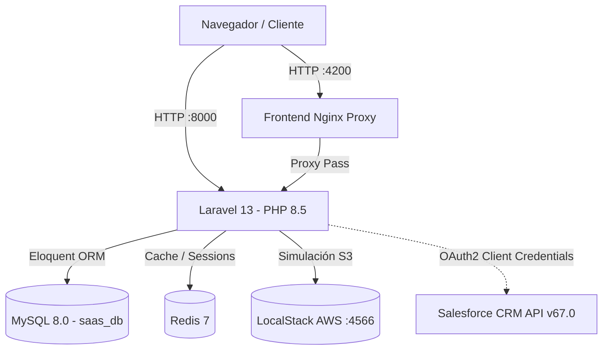

# PS Tenant — Sistema SaaS Multitenant de Gestión de Inventario y Ventas

**Proyecto Capstone Final**
**Integrantes del Equipo:**
- José Carlos Muñoz Alberti
- Leonardo David Vargas Monasterio

---

## 1. Visión General del Proyecto
PS Tenant es una plataforma SaaS (Software as a Service) multitenant orientada a la gestión centralizada de inventarios, productos y ventas para múltiples empresas. Ofrece aislamiento automático por tenant_id, validado mediante pruebas automatizadas para reducir el riesgo de acceso cruzado entre tenants, una interfaz web reactiva sin dependencias de frameworks SPA pesados, flujo transaccional de cobro QR con descuento único de stock, e integración M2M con Salesforce CRM via OAuth 2.0 Client Credentials.

---

## 2. Objetivo Académico y Funcional
El objetivo del proyecto es demostrar una arquitectura SaaS profesional y reproducible:
- **Multitenancy seguro:** Aislamiento automático por tenant_id, validado mediante pruebas automatizadas para reducir el riesgo de acceso cruzado entre tenants.
- **Transaccionalidad e Idempotencia:** Procesamiento de pagos QR con bloqueo pesimista `lockForUpdate()` y prevención de doble descuento de inventario.
- **Integración con Salesforce:** La sincronización con Salesforce se ejecuta después del commit de la transacción local. Los errores de Salesforce no revierten el pago ni el descuento de stock.
- **Despliegue Multi-contenedor:** Entorno estandarizado en Docker Compose con 5 servicios interconectados.

---

## 3. Funcionalidades Principales
- Autenticación mediante Laravel Sanctum (Bearer Token).
- Aislamiento automático por `tenant_id` gobernado por `Trait Multitenant`.
- Dashboard de métricas e indicadores actualizados de inventario.
- Catálogo interactivo de productos con paginación, ordenamiento y búsqueda con debounce (400ms).
- Punto de Venta (POS) y carrito de compras dinámico.
- Generación de código de pago QR y simulación de confirmación bancaria.
- Sincronización post-commit tolerante a fallos hacia Salesforce CRM.

---

## 4. Arquitectura del Sistema



---

## 5. Tabla de los Cinco Servicios Docker

| Servicio | Nombre Contenedor | Puerto Host | Puerto Contenedor | Descripción / Salud |
|----------|-------------------|-------------|-------------------|---------------------|
| **`app`** | `ps-tenant-app-1` | `8000` | `8000` | Laravel 13 en PHP 8.5 CLI |
| **`db`** | `ps-tenant-db-1` | `3307` | `3306` | Base de datos MySQL 8.0 (`healthy`) |
| **`redis`** | `ps-tenant-redis-1` | `6379` | `6379` | Cache Redis 7 Alpine (`healthy`) |
| **`frontend`** | `ps-tenant-frontend-1` | `4200` | `4200` | Reverse Proxy Nginx para Blade/JS |
| **`localstack`** | `ps-tenant-localstack` | `4566` | `4566` | Emulación AWS LocalStack 4.14.0 (`healthy`) |

---

## 6. Tecnologías Utilizadas
- **Backend:** Laravel 13.8, PHP 8.5, Laravel Sanctum 4.0.
- **Frontend:** Laravel Blade, Bootstrap 5.3 CDN, Bootstrap Icons 1.11, Vanilla JavaScript ES6+.
- **Base de Datos:** MySQL 8.0, Redis 7.0.
- **Integración CRM:** Salesforce External Client App (OAuth 2.0 Client Credentials Grant, REST API v67.0).
- **Contenedores & CI/CD:** Docker Compose, Nginx Alpine, GitHub Actions.

---

## 7. Requisitos Previos
- Docker Desktop (con Docker Compose v2+) instalado y en ejecución.
- Git.
- PowerShell (en entorno Windows).

---

## 8. Estructura Principal del Repositorio
```text
ps-tenant/
├── .github/
│   └── workflows/
│       └── tests.yml              # CI/CD GitHub Actions
├── docs/
│   └── Auditoria_IA_Proyecto_Final.md # Matriz de Auditoría de IA
├── frontend/
│   ├── Dockerfile                 # Dockerfile de Nginx Proxy
│   └── nginx.conf                 # Configuración Reverse Proxy puerto 4200
├── saas/                          # Proyecto Laravel 13
│   ├── app/
│   │   ├── Http/Controllers/      # Auth, Producto, Venta, Pago
│   │   ├── Models/                # User, Tenant, Producto, Venta, DetalleVenta
│   │   ├── Services/              # SalesforceService.php
│   │   └── Traits/                # Multitenant.php (Global Scope)
│   ├── config/services.php        # Configuración de Salesforce
│   ├── database/migrations/       # Migraciones incrementales
│   ├── public/js/                 # Módulos JS (productos.js, ventas.js, etc.)
│   ├── resources/views/           # Vistas Blade (layout, dashboard, productos, ventas)
│   └── tests/Feature/             # Pruebas automatizadas Multitenant y Ventas
├── scripts/
│   └── init-localstack.sh         # Script de inicio idempotente para LocalStack S3
├── docker-compose.yml             # Orquestación de los 5 servicios
├── probar-multitenant.ps1         # Script PowerShell seguro para ejecutar tests
└── README.md                      # Documentación del proyecto
```

---

## 9. Instalación desde Cero (Comandos copiables para PowerShell)

Siga este orden de ejecución paso a paso en su terminal de PowerShell:

```powershell
# 1. Clonar el repositorio e ingresar a la carpeta
git clone <url-del-repositorio>
cd ps-tenant

# 2. Copiar el archivo de variables de entorno
Copy-Item .\saas\.env.example .\saas\.env

# 3. Detener y limpiar contenedores previos (sin eliminar volúmenes de datos)
docker compose down --remove-orphans

# 4. Construir y levantar los 5 servicios en segundo plano
docker compose up -d --build

# 5. Verificar que los 5 contenedores estén activos y saludables
docker compose ps

# 6. Generar la clave de la aplicación Laravel
docker compose exec app php artisan key:generate

# 7. Ejecutar migraciones en la base de datos de desarrollo (saas_db)
docker compose exec app php artisan migrate

# 8. Poblado idempotente de datos de demostración
docker compose exec app php artisan db:seed --class=DatabaseSeeder
```

---

## 10. Variables de Entorno en `saas/.env`

### Base de Datos:
```env
DB_CONNECTION=mysql
DB_HOST=db
DB_PORT=3306
DB_DATABASE=saas_db
DB_USERNAME=saas_user
DB_PASSWORD=secret_pass
```

### Redis:
```env
REDIS_CLIENT=phpredis
REDIS_HOST=redis
REDIS_PORT=6379
```

### Salesforce (OAuth 2.0 Client Credentials):
```env
SF_ENABLED=false
SF_LOGIN_URL=https://tu-dominio.develop.my.salesforce.com
SF_CLIENT_ID=
SF_CLIENT_SECRET=
SF_API_VERSION=v67.0
```

---

## 11. Acceso a las Interfaces y Usuarios de Demostración

### URLs de Acceso:
- **Frontend Reverse Proxy:** [http://localhost:4200](http://localhost:4200)
- **Backend Acceso Directo:** [http://localhost:8000](http://localhost:8000)
- **LocalStack Healthcheck:** [http://localhost:4566/_localstack/health](http://localhost:4566/_localstack/health)

### Usuarios de Demostración (Entorno Local/Académico):

| Empresa (Tenant) | Usuario | Contraseña de Desarrollo | Rol |
|------------------|---------|-------------------------|-----|
| **SALQUI S.R.L.** | `admin@salqui.com` | `Clave12345` | Admin |
| **Gran Palacio de la Industria** | `admin@palacio.com` | `Clave12345` | Admin |

> **Nota de Seguridad:** Las contraseñas indicadas son únicamente para pruebas locales en desarrollo y están registradas en los seeders de demostración. Recomiende cambiar las credenciales al desplegar en producción.

---

## 12. Autenticación y Aislamiento Multitenant

- **Login y Sanctum:** Al iniciar sesión en `/login`, el backend autentica contra `POST /api/login` y entrega un token Sanctum que se almacena en `localStorage` (`saas_token`).
- **Mecanismo Multitenant:** La asociación `User -> Tenant` se establece en la base de datos. Todas las consultas Eloquent aplican automáticamente el `Trait Multitenant` agregando la cláusula `WHERE tenant_id = ?`.
- **Demostración de Aislamiento:**
  1. Inicie sesión como `admin@salqui.com` en `http://localhost:4200/productos` y agregue un producto exclusivo.
  2. Cierre sesión e ingrese como `admin@palacio.com`.
  3. Verifique que los productos de SALQUI no aparecen ni en la tabla de productos ni en el POS de ventas.

---

## 13. Flujo Completo de Ventas, Pago QR e Idempotencia

1. **Creación de Venta:** En `http://localhost:4200/ventas`, agregue productos al carrito y presione **"Registrar Venta"**. Se envía `POST /api/ventas` creando la venta en estado `pendiente`. Los precios se calculan estrictamente en el backend y no se descuenta stock todavía.
2. **Generación de QR:** Al presionar **"Cobrar"**, se invoca `POST /api/ventas/{id}/qr`. El servidor asigna una referencia única (ej. `QR-ABC12345-1`) y devuelve el monto y el texto del QR. El frontend renderiza visualmente un QR local en un elemento Canvas.
3. **Confirmación Bancaria:** Presione **"Simular Confirmación Bancaria"**. Se envía `POST /api/pagos/confirmar`. En una transacción pesimista `lockForUpdate()`, el backend verifica el stock disponible, descuenta las unidades compradas de cada producto y cambia el estado a `pagada`.
4. **Idempotencia Garantizada:** Si se envía una confirmación repetida con la misma referencia de pago, el servidor detecta que la venta ya está `pagada`, devuelve `idempotente: true` con HTTP 200 OK y **NO vuelve a descontar el inventario**.

---

## 14. Configuración de Salesforce External Client App

El sistema se integra con Salesforce utilizando la arquitectura **External Client App** autorizada mediante **OAuth 2.0 Client Credentials Grant**.

### Pasos en Salesforce:
1. Crear una **External Client App** con OAuth habilitado.
2. Configurar el flujo **Client Credentials Flow**.
3. Asignar un usuario de ejecución en **Run As User**.
4. Autorizar los scopes de API (`api`, `web`).
5. Otorgar preautorización administrativa en las políticas de la aplicación.
6. Copiar el **Consumer Key** (`client_id`) y **Consumer Secret** (`client_secret`).

### Activación en Laravel (`saas/.env`):
```env
SF_ENABLED=true
SF_LOGIN_URL=https://tu-dominio.develop.my.salesforce.com
SF_CLIENT_ID=
SF_CLIENT_SECRET=
SF_API_VERSION=v67.0
```

> **Importante sobre `SF_LOGIN_URL`:** Debe contener únicamente el esquema y host base (ej. `https://tu-dominio.develop.my.salesforce.com`). No agregue rutas internas como `/services/oauth2/token` ya que Laravel las añade automáticamente.

### Sincronización de Opportunity:
Al confirmar un pago, tras cerrar la transacción local, `SalesforceService` envía una solicitud HTTP POST creando una `Opportunity`:
- **`Name`:** `"Venta #{id} - {nombre_tenant}"`
- **`Amount`:** Total de la venta.
- **`StageName`:** `"Closed Won"`
- **`CloseDate`:** Fecha de pago (`Y-m-d`).

El estado de la sincronización se guarda en MySQL (`salesforce_id`, `salesforce_sync_status`, `salesforce_sync_error`). Si Salesforce no responde o las credenciales fallan, **el pago local y el descuento de stock se mantienen intactos**.

---

## 15. Ejecución de Pruebas Automatizadas

Las pruebas automatizadas utilizan una base de datos aislada `saas_test` con Salesforce en modo simulado (`SF_ENABLED=false` e `Http::fake()`).

### Comando en Windows (PowerShell):
```powershell
.\probar-multitenant.ps1
```

### O ejecute la suite directamente en Docker:
```bash
docker compose exec -e APP_ENV=testing -e DB_DATABASE=saas_test -e SF_ENABLED=false app php artisan test
```

---

## 16. Integración Continua (GitHub Actions)
El workflow `.github/workflows/tests.yml` ejecuta automáticamente la suite en cada `push` o `pull_request` sobre `main`, `master` o `develop`, levantando servicios en contenedor para MySQL 8 y Redis en PHP 8.3/8.5. El workflow más reciente fue verificado en verde.

---

## 17. Guía Paso a Paso para la Demostración / Defensa Académica

1. **Estado de Contenedores:** Ejecutar `docker compose ps` y verificar los 5 servicios en estado `healthy` o `running`.
2. **Tenant 1 (SALQUI):** Iniciar sesión en `http://localhost:4200/login` con `admin@salqui.com` (`Clave12345`). Mostrar el Dashboard y el catálogo de Productos.
3. **Tenant 2 (Gran Palacio):** Abrir ventana de incógnito en `http://localhost:4200/login` e ingresar con `admin@palacio.com` (`Clave12345`). Demostrar el aislamiento multitenant comprobando que no se listan los productos del Tenant 1.
4. **Registro de Venta:** En el Tenant 1, ir a `/ventas`, agregar 2 productos al carrito y presionar **"Registrar Venta"**.
5. **Cobro QR y Confirmación:** Presionar **"Cobrar"**, visualizar el QR en canvas y presionar **"Simular Confirmación Bancaria"**.
6. **Verificación de Inventario:** Comprobar que el estado de la venta cambió a `PAGADA` y el stock de los productos se redujo exactamente en las cantidades vendidas.
7. **Idempotencia:** Reintentar una confirmación con la misma referencia de pago y verificar que no se vuelve a descontar el stock.
8. **Salesforce & Base de Datos:** Consultar la tabla `ventas` en MySQL mostrando `salesforce_id` y `salesforce_sync_status` (`sincronizada`). Si se probó con credenciales reales de Salesforce, mostrar la Opportunity creada en la consola de Salesforce.
9. **Pruebas Automatizadas:** Ejecutar `.\probar-multitenant.ps1` en PowerShell demostrando las 21 pruebas en verde.

---

## 18. Solución de Problemas Frecuentes

### A. Error `unsupported_grant_type` en Salesforce:
- **Causa:** Se está enviando `grant_type=password` o la External Client App no tiene habilitado el Client Credentials Flow.
- **Solución:** Verifique que `SalesforceService` use `grant_type=client_credentials` y que la External Client App tenga el flujo activado en Salesforce.

### B. Error `no client credentials user enabled` o `user is not admin approved`:
- **Causa:** Falta asignar un usuario en **Run As User** o falta la preautorización administrativa en las políticas de OAuth de Salesforce.
- **Solución:** En Salesforce, vaya a la configuración de la External Client App -> OAuth Policies -> asignar **Run As User** y seleccionar **Admin approved users are pre-authorized**.

### C. Error `URI must include a scheme and host`:
- **Causa:** La variable `SF_LOGIN_URL` en `saas/.env` está vacía o no incluye `https://`.
- **Solución:** Defina `SF_LOGIN_URL=https://tu-dominio.develop.my.salesforce.com`.

### D. Cambios de `.env` no se reflejan:
- **Solución:** Limpie la caché de configuración en Laravel ejecutando:
  ```bash
  docker compose exec app php artisan config:clear
  ```

---

## 19. Seguridad y Gestión de Secretos
- **Protección de Credenciales:** NUNCA incluya el Consumer Key (`client_id`) ni Consumer Secret (`client_secret`) reales en el archivo `.env.example` o en el repositorio Git.
- **Aislamiento Backend:** Las claves privadas residen exclusivamente en el archivo `saas/.env` del entorno local/servidor y están excluidas en `.gitignore`.

---

## 20. Matriz Final de Cumplimiento

| Requisito de Auditoría | Evidencia Técnica | Evidencia Manual / Documental | Estado |
|------------------------|-------------------|--------------------------------|--------|
| **1. 5 Servicios Docker** | `docker compose ps` mostrando `app`, `db`, `redis`, `frontend`, `localstack`. | Verificado en salud `healthy`. | **Cumplido** |
| **2. Login Sanctum & Multitenant** | `Trait Multitenant` y tests `ProductoMultitenantTest`. | Demostración entre SALQUI y Gran Palacio. | **Cumplido** |
| **3. Flujo Venta y Cobro QR** | `VentaController`, `PagoController` y `ventas.js`. | Simulación de pago QR en `/ventas`. | **Cumplido** |
| **4. Descuento Idempotente de Stock** | Bloqueo pesimista `lockForUpdate()` en `PagoController.php`. | Aserción `idempotente: true` en test. | **Cumplido** |
| **5. Salesforce OAuth Client Credentials** | `SalesforceService.php` usando REST API `v67.0`. | Confirmación 200 OK y Opportunity en Salesforce. | **Cumplido con evidencia manual** |
| **6. Pruebas Automatizadas** | 21 pruebas pasadas en `saas_test`. | Ejecución exitosa con `probar-multitenant.ps1`. | **Cumplido** |
| **7. CI/CD GitHub Actions** | `.github/workflows/tests.yml` configurado con MySQL 8 y Redis. | Workflow más reciente verificado en verde. | **Cumplido con evidencia manual** |
